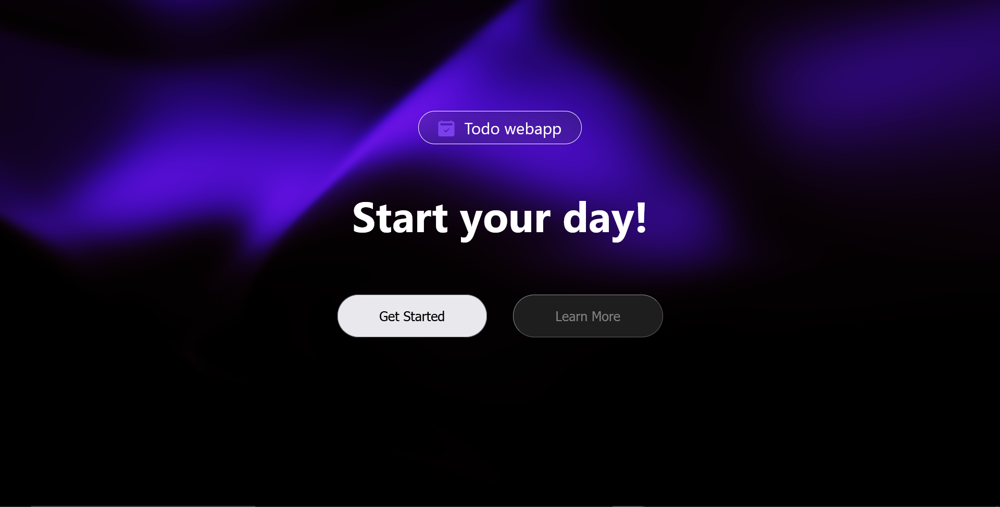
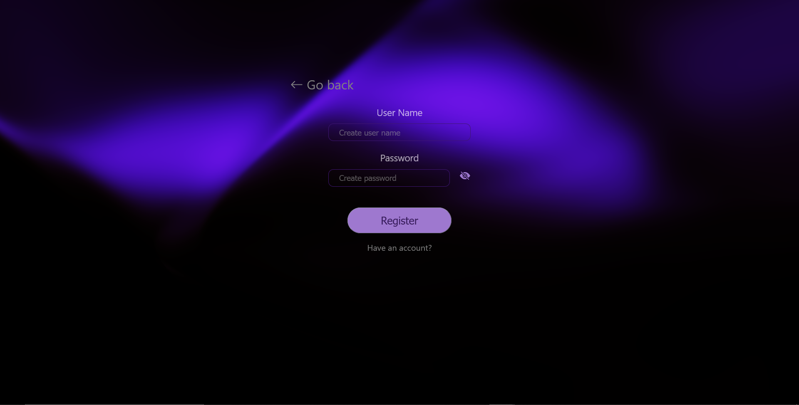
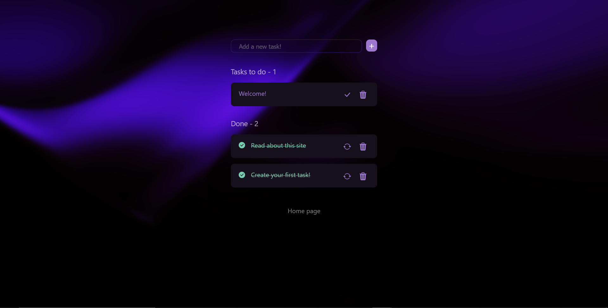
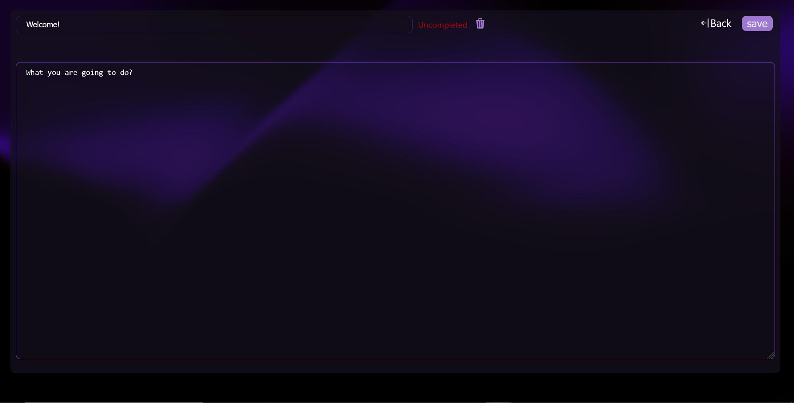

📝 React ToDo Web App

This project was created as part of learning React. The main focus was on the visual design and appearance of the site rather than implementing complex business logic or backend functionality.
Main Features:
  Create, edit, and delete tasks
  Mark tasks as completed
  Modern, responsive user interface
  Backend communication using Axios

Tech Stack:

🖥️ Frontend:

    React
    
    JavaScript
    
    HTML / CSS

🔧 Backend:

    C# (.NET 8)
    
    Custom REST API
    
    SQL Database

Registration in this project was made optional on purpose. You can bypass the registration/login step by directly navigating to the /todos page in the browser address bar.
Simply enter: http://localhost:3000/todos to access the main task list without signing in.

Home Page | 
Registration Page | 
Task List | 
Note Editing | 
